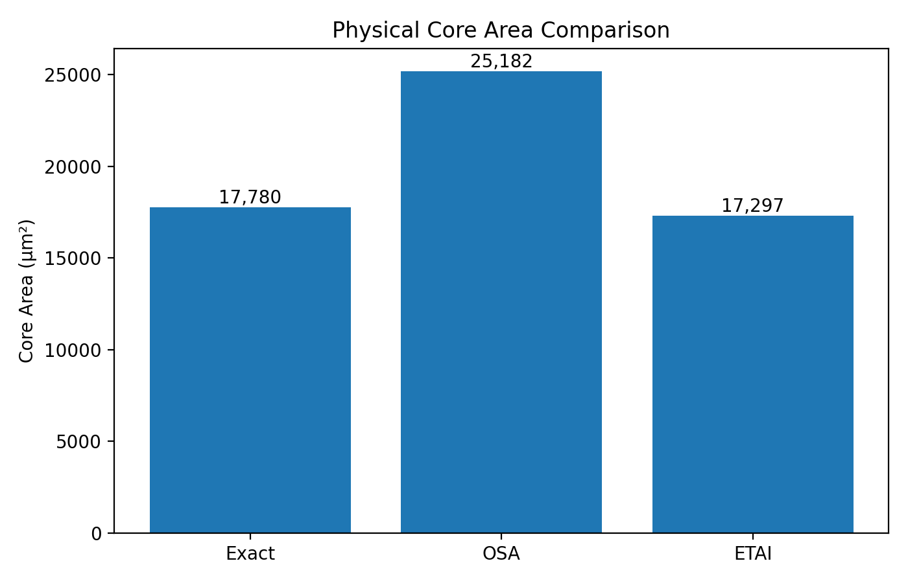
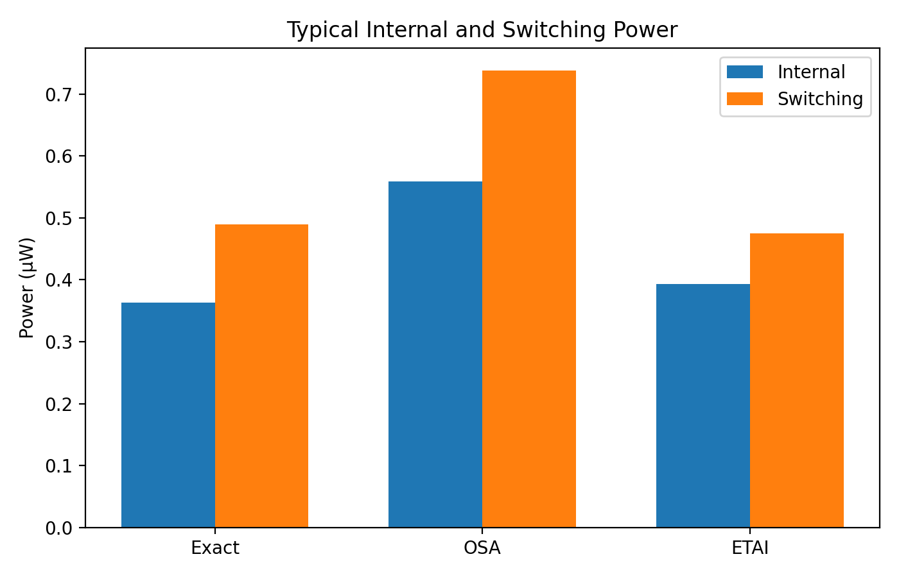
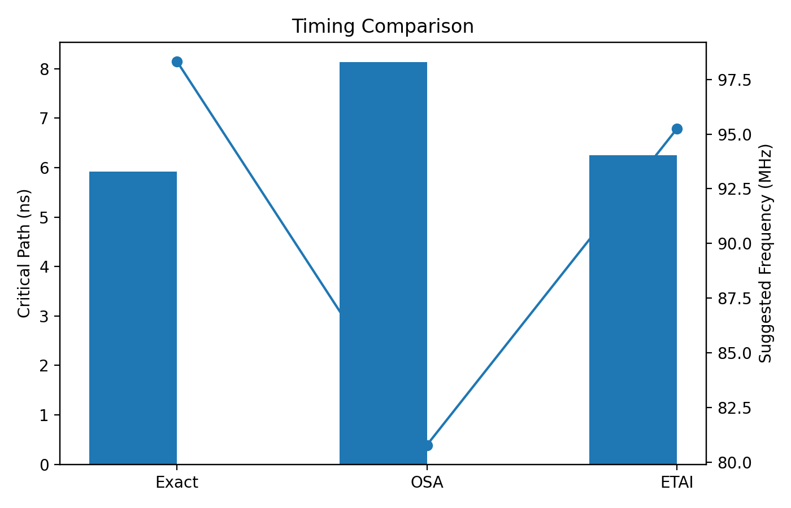
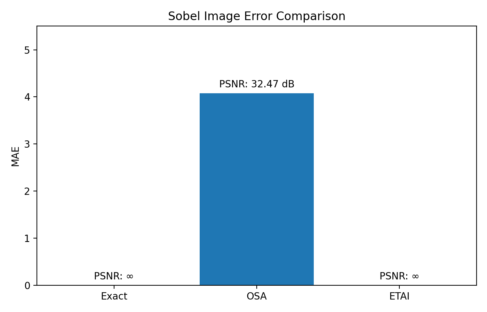
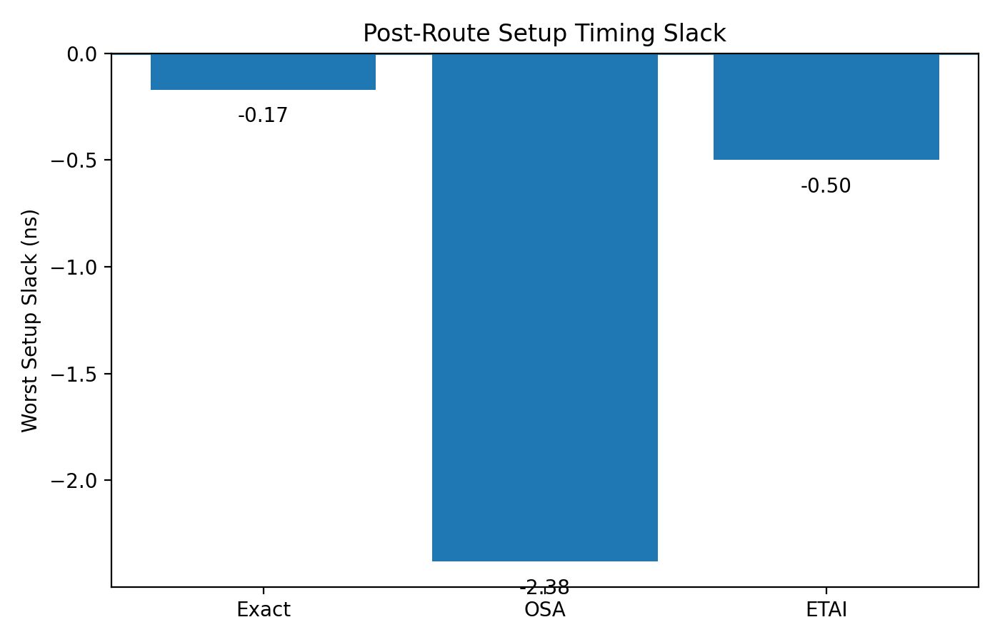
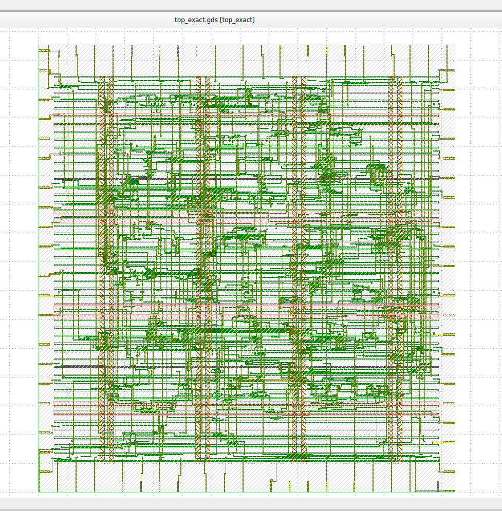
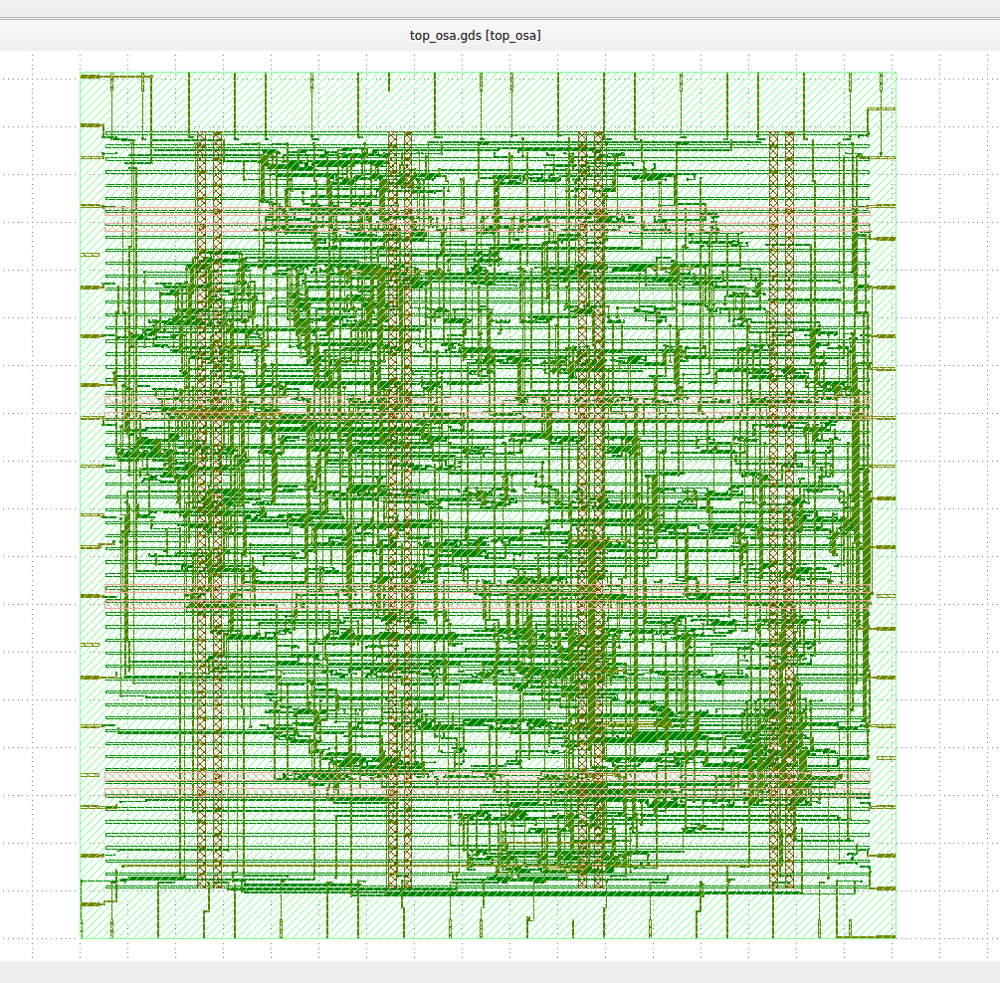
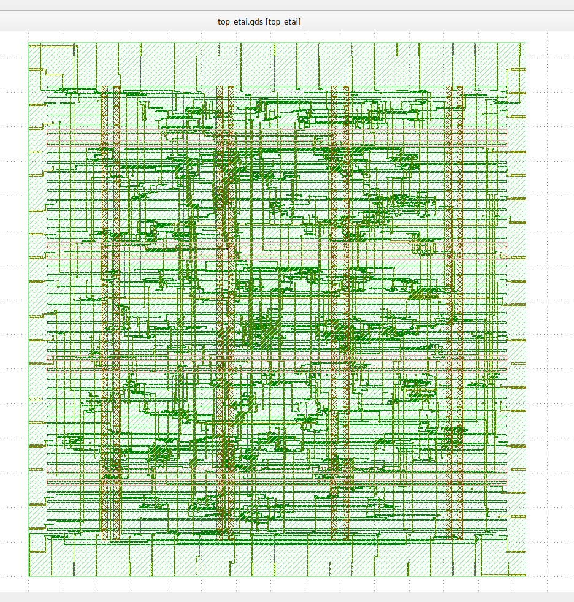

# Approximate Sobel Edge Detection — VLSI Implementation

An RTL-to-GDSII implementation study of an approximate Sobel edge-detection architecture using approximate multipliers.

The project compares three multiplier architectures:

- **Exact Multiplier** — reference implementation
- **OSA Multiplier** — approximate multiplier
- **ETAI Multiplier** — approximate multiplier

The designs are integrated into a Sobel gradient-magnitude computation and evaluated in terms of **area, power, timing, and image quality**.

---

## Project Overview

Sobel edge detection is widely used in image-processing applications to identify edges by calculating image intensity gradients.

The conventional Sobel operator requires multiple arithmetic operations, including multiplication and addition. Since multiplication contributes significantly to hardware complexity, approximate multipliers can be used to reduce hardware cost at the expense of a controlled loss in numerical accuracy.

This project investigates that trade-off by implementing exact and approximate multiplier architectures and integrating them into a Sobel edge-detection datapath.

---

## Architecture

The project contains three main implementations:

| Architecture | Multiplier | Purpose |
|---|---|---|
| Exact | Exact multiplier | Reference design |
| OSA | OSA approximate multiplier | Reduced hardware complexity |
| ETAI | ETAI approximate multiplier | Area/power-efficient computation |

The approximate designs are compared against the exact implementation to evaluate the hardware-versus-image-quality trade-off.

---

## Sobel Processing

The Sobel operator uses horizontal and vertical gradient kernels:

```text
Gx = [-1  0  +1]
     [-2  0  +2]
     [-1  0  +1]

Gy = [-1  -2  -1]
     [ 0   0   0]
     [+1  +2  +1]
```

The gradient magnitude is approximated as:

```text
|G| ≈ |Gx| + |Gy|
```

The RTL implementation contains dedicated modules for the multiplier, gradient calculation, magnitude calculation, and Sobel top-level datapath.

---

## RTL Modules

### Core RTL

```text
rtl/
├── sobel_top.v
├── sobel_mac.v
├── gradient_mag.v
├── mult_wrapper.v
├── exact_mult.v
├── osa_mult.v
├── etai_mult.v
├── leading_one_detector.v
└── segment_extract.v
```

### Synthesis Wrappers

```text
synth/
├── top_exact.v
├── top_osa.v
└── top_etai.v
```

The synthesis wrappers provide separate top-level designs for comparing the three multiplier architectures.

---

## Physical Design

OpenLane configurations are provided for all three implementations:

```text
openlane/
├── top_exact/
│   └── config.json
├── top_osa/
│   └── config.json
└── top_etai/
    └── config.json
```

The designs can be evaluated through an RTL-to-physical-design flow targeting the **SkyWater SKY130** technology.

The flow enables comparison of the exact and approximate architectures using physical implementation metrics.

---

## Results

The repository includes comparison plots for the major evaluation metrics.

### Area



### Power



### Timing



### Image Quality



### Setup Slack



---

## Evaluation Metrics

The architectures are evaluated using:

### 1. Area

Measures the hardware resources required by each implementation.

A smaller area indicates a more compact hardware implementation.

### 2. Power

Measures the estimated power consumption of the implementation.

Approximate arithmetic can potentially reduce switching activity and hardware complexity.

### 3. Timing

The timing results are used to compare the performance of the three architectures.

### 4. Setup Slack

Setup slack indicates whether timing constraints are satisfied.

Positive setup slack indicates that the corresponding setup timing requirement is met.

### 5. Image Quality

The approximate multipliers are also evaluated at the application level.

The resulting Sobel images are compared with the exact/reference implementation to determine the effect of arithmetic approximation on edge-detection quality.

---

## Key Design Trade-off

Approximate computing introduces a fundamental trade-off:

```text
Reduced Hardware Cost
        ↓
 Area / Power / Performance Benefits
        ↓
Controlled Arithmetic Error
        ↓
Possible Image-Quality Degradation
```

The objective is not simply to minimize hardware cost, but to determine whether the reduction in hardware resources is acceptable for an image-processing application.

---

## Tools and Technologies

- Verilog HDL
- RTL Design
- Approximate Computing
- Digital VLSI Design
- Sobel Edge Detection
- OpenLane
- SKY130 PDK
- RTL Synthesis
- Physical Design
- ModelSim / Verilog Simulation
- Python-based result analysis

---

## Repository Structure

```text
approx-sobel-vlsi/
│
├── rtl/
│   ├── sobel_top.v
│   ├── sobel_mac.v
│   ├── gradient_mag.v
│   ├── mult_wrapper.v
│   ├── exact_mult.v
│   ├── osa_mult.v
│   ├── etai_mult.v
│   ├── leading_one_detector.v
│   └── segment_extract.v
│
├── synth/
│   ├── top_exact.v
│   ├── top_osa.v
│   └── top_etai.v
│
├── openlane/
│   ├── top_exact/
│   │   └── config.json
│   ├── top_osa/
│   │   └── config.json
│   └── top_etai/
│       └── config.json
│
├── results/
│   └── graphs/
│       ├── 01_area_comparison.png
│       ├── 02_power_comparison.png
│       ├── 03_timing_comparison.png
│       ├── 04_image_quality_comparison.png
│       └── 05_setup_slack_comparison.png
│
└── README.md
```

---

## Objective

The main objective of this project is to study whether approximate arithmetic can provide meaningful hardware benefits for edge-detection applications while maintaining acceptable image quality.

The comparison between exact, OSA, and ETAI implementations provides insight into the trade-offs between:

**Hardware efficiency ↔ Computational accuracy**

---

## Future Work

Possible extensions include:

- Full RTL-to-GDSII implementation of the complete Sobel accelerator
- Evaluation across additional image datasets
- PSNR and SSIM based image-quality analysis
- Additional approximate multiplier architectures
- Frequency and voltage scaling analysis
- FPGA implementation
- Comparison across different technology nodes

---

## Author

**Manish Mogaveera**
Electronics and Communication Engineering
Dayananda Sagar College of Engineering, Bengaluru

---

## License

This project is intended for academic, research, and educational purposes.


## Physical Layout

### Exact Implementation



### OSA Approximate Implementation



### ETAI Approximate Implementation


